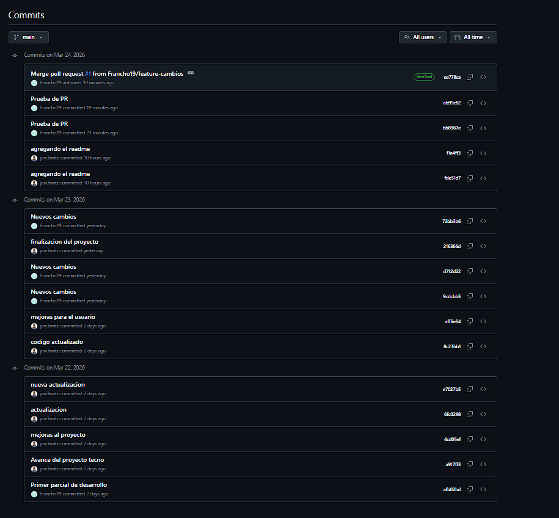
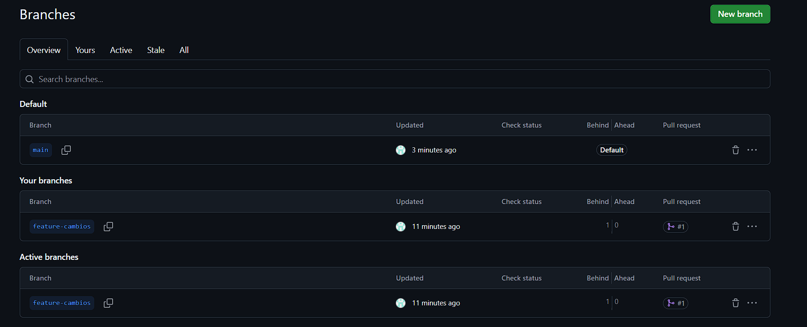
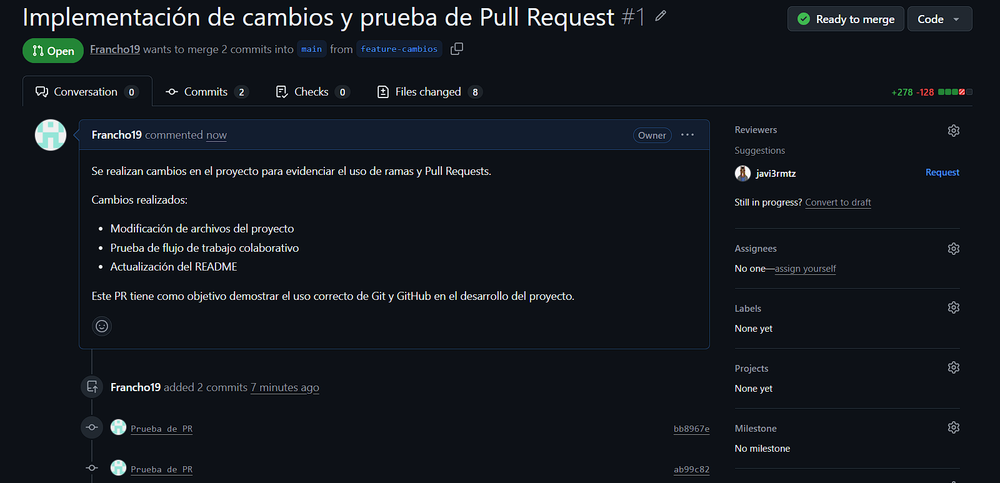
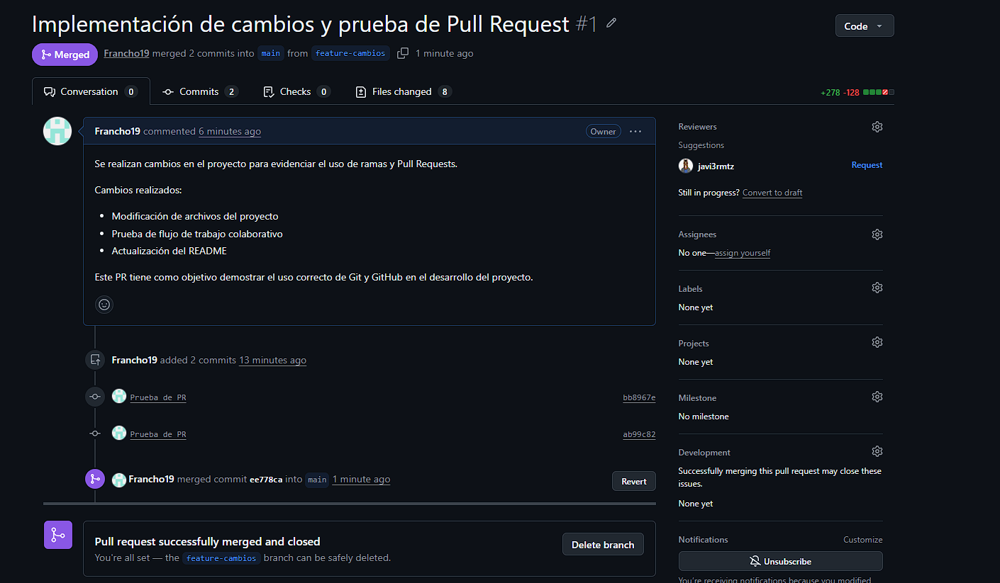
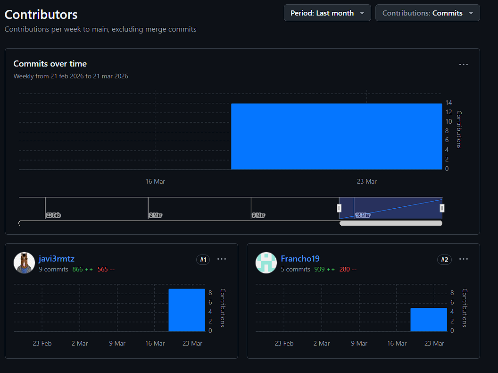

# techStore

Aplicación web de tienda tecnológica desarrollada con HTML, CSS y JavaScript.
Permite iniciar sesión, visualizar productos, agregarlos a un carrito y generar un recibo con IVA.

---

## Trabajo colaborativo

Este proyecto fue desarrollado en equipo utilizando GitHub.

### Integrantes

* Frank José Miranda Beleño - 192526
* Javier Andrés Martínez Martínez - 192528

---

## Funcionalidades

* Inicio de sesión con validación en JavaScript
* Renderización dinámica de productos
* Carrito de compras con almacenamiento en localStorage
* Generación de recibo con IVA (19%) y fecha
* Uso de Web Components (header, sidebar, footer)
* Carga de productos desde un archivo JSON mediante fetch

---

## Conceptos implementados

### Fragmentos

Se utilizan fragmentos del DOM al trabajar con plantillas, permitiendo manipular contenido antes de insertarlo en la página.

```js
const clone = template.content.cloneNode(true);
```

---

### Plantillas (`<template>`)

Se utilizó la etiqueta `<template>` para definir la estructura de los productos, permitiendo su reutilización y renderización dinámica.

```html
<template id="productTemplate">
```

---

### Web Components

Se implementaron componentes personalizados mediante clases que extienden de `HTMLElement`, usando Shadow DOM.

```js
class AppHeader extends HTMLElement {
    constructor() {
        super();
        this.attachShadow({ mode: "open" });
    }
}

customElements.define("app-header", AppHeader);
```

---

## Implementación del login

El formulario de inicio de sesión se desarrolló con validación en JavaScript.

**Credenciales:**

* Usuario: user
* Contraseña: admin

```js
if (usuario === "user" && password === "admin")
```

Se utiliza `sessionStorage` para mantener la sesión activa y restringir acceso.

---

## Buenas prácticas aplicadas

* Organización del proyecto en carpetas
* Separación de HTML, CSS y JavaScript
* Uso de nombres descriptivos
* Manejo de errores con try/catch
* Uso de fetch
* Uso de localStorage y sessionStorage
* Código modular
* Web Components

---

## Evidencias de colaboración en GitHub

### Commits



---

### Ramas (Branches)



---

### Pull Requests



---

### PR Merged



---

### Colaboradores



---

## Estructura del proyecto

```
PRIMER-PARCIAL-DESARROLLO-WEB/
│
├── components/
│   ├── footer.html
│   ├── header.html
│   └── sidebar.html
│
├── css/
│   └── styles.css
│
├── data/
│   └── productos.json
│
├── docs/
│   └── img/
│       ├── branch.png
│       ├── commits.png
│       ├── contributors.png
│       ├── pr-merged.png
│       └── pr.png
│
├── img/
│   ├── audifonos.jpg
│   ├── celular.jpg
│   ├── laptop.jpg
│   └── monitor.jpg
│
├── js/
│   ├── components.js
│   ├── login.js
│   ├── main.js
│   └── recibo.js
│
├── index.html
├── login.html
└── README.md
```

---

## Repositorio

Agregar aquí el enlace del repositorio en GitHub.

---

## Conclusión

El proyecto integra conceptos fundamentales del desarrollo web como renderización dinámica, manejo de datos externos, uso de componentes reutilizables y trabajo colaborativo mediante Git. Se obtiene una aplicación funcional, organizada y bien estructurada.
